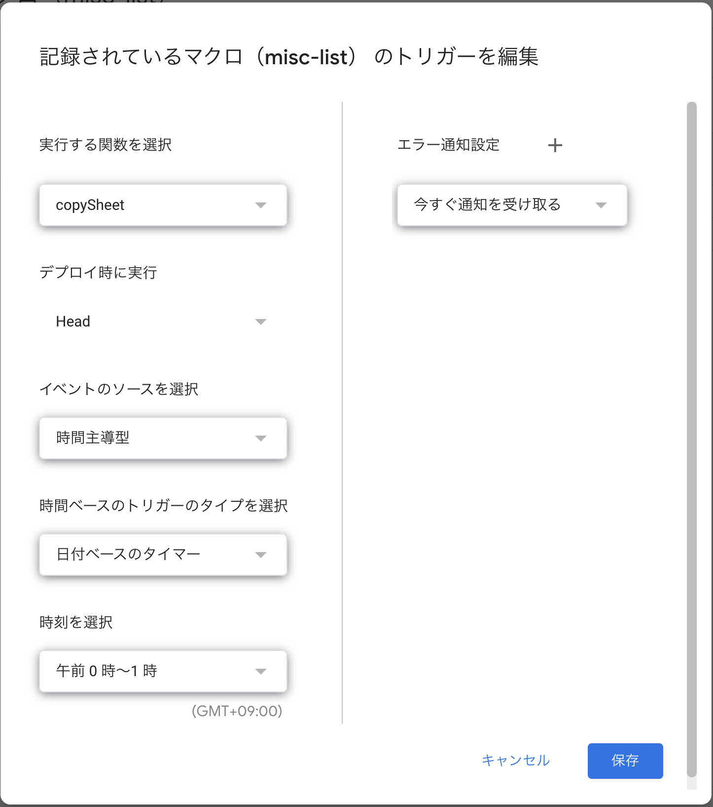
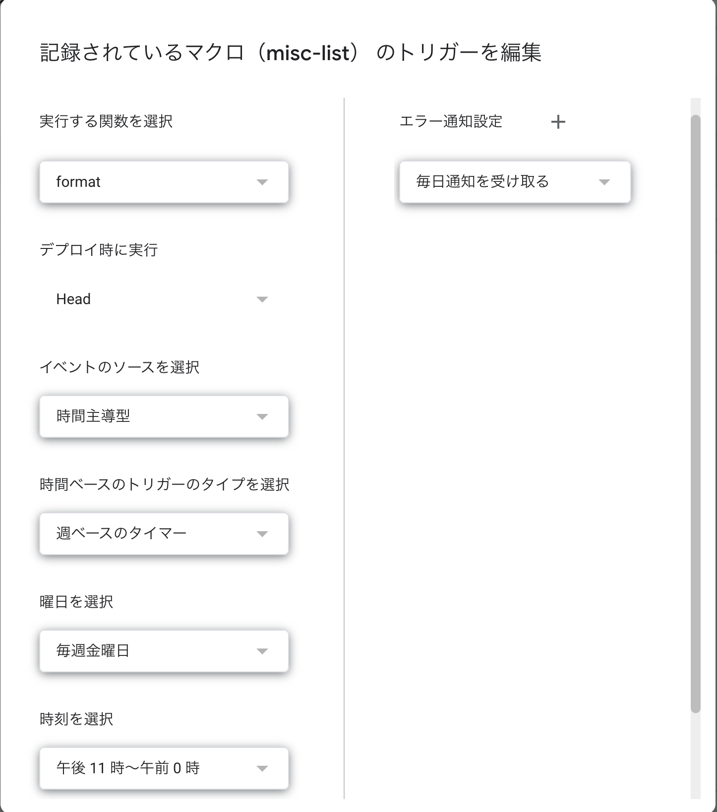

# 部活動出席確認システム
nfcタグによる出席管理システムです。
Googleスプレッドシートで管理できます。
また設定時間に音楽が流れます

## 必要なもの
- RaspberryPi
- PaSoRi

## 使用サービス/言語
- Google スプレッドシート
- Apps Script
- Google Drive API
- Python 3.8~

## セットアップ - スプレッドシート
1. [このサイト](https://www.twilio.com/blog/an-easy-way-to-read-and-write-to-a-google-spreadsheet-in-python-jp)に従って鍵を生成し、ファイル名を `client_secret.json` にする
2.  `名簿` `テンプレート` シートを追加する
3. `gas.js`　を Apps Script にコピーし、トリガーを設定する

### シートの設定
#### 名簿
| A          | B        | C   | D   | E     | F    | G      | H                 | I             |
|------------|----------|-----|-----|-------|------|--------|-------------------|---------------|
| [連番用関数] | 氏名     | 学科 | 学年 | クラス | 番号 | 学籍番号 | RFID              | ［ソート用関数］ |
| (0)        | 佐藤 智   | J   | 3   | Z     |  46  | 65536  | ABCDEF1234567890  | (3JZ46)       |
| (1)        | 多田 隆人 | J   | 3   | Z     |  46  | 65536  | ABCDEF1234567890  | (3JZ46)       |
| 以下同様    |          |     |     |       |      |        |                   |               |

#### テンプレート
| A          | B      | C   | D   | E     | F    | G      | H          | | J          | K  | L | M | ...  | AO  | AP          |
|------------|--------|-----|-----|-------|------|--------|------------|-|------------|----|---|---|------|-----|-------------|
| [連番用関数] | 氏名   | 学科 | 学年 | クラス | 番号 | 学籍番号 | ソート用関数 | | 合計        | 1  | 2 | 3 | ...  | 31  | 合計        |
| (0)        |        |     |     |       |      |        |            | | [合計用関数] |    |   |   |      |     | [合計用関数] | 
| (1)        |        |     |     |       |      |        |            | | [合計用関数] |    |   |   |      |     | [合計用関数] |
| 以下同様    |        |     |     |       |      |        |            | | [合計用関数] |    |   |   |      |     | [合計用関数] |

#### 連番用関数
- 1列目のみ
```
=ARRAYFORMULA(IF(ISBLANK($G$1:$G$150),"",COUNTIFS($G$1:$G$150,"<>'",ROW($G$1:$G$150),"<="&ROW($G$1:$G$150)-1)))
```
#### ソート用関数
- 1列目のみ
```
=ARRAYFORMULA($D$1:$D$150 & $C$1:$C$150 & $E$1:$E$150 & IF(ISBLANK($G$1:$G$150),"", TEXT($F$1:$F$150,"00")))
```

#### 合計用関数
- 全列に追加('2'は適宜変更)
```
=IF(ISBLANK(B2),"", COUNTA(K2:AO2))
```

#### トリガー





## セットアップ - Python/音源
1. ライブラリをインストール
   ```shell
   pip install -r requirements.txt
   ```
2. `check.py` と `periodic.py` 内の `TODO` 部分を各自変更する
3. 音源を各自ダウンロードし、`sounds/` に入れる

### 変更点
```python
[check.py]
SE_ENTRY = '入室時'
SE_EXIT  = '退室時'
SE_ERROR = 'エラー時'
SE_NEW   = '新規追加時'
SE_NONE  = '未登録時'

SPREADSHEET_APP = 'スプレッドシート名'
ROSTER_NAME = '名簿シート名'
```

```python
[periodic.py]
MUSIC_FILE = '流す音楽'
SPREADSHEET_APP = 'スプレッドシート名'
SETTING_SHEET = '設定シート名'
```


## セットアップ - systemctl
1. 以下のファイルを `/etc/systemd/system/` に用意する

### check.service
```shell
[Unit]
Description = check.py

[Service]
ExecStart=/usr/bin/python3 [パス]/check.py
```

### check.timer
```shell
[Unit]
Description=daily do something

[Timer]
OnBootSec=1min
Unit=fes_check.server

[Install]
WantedBy=timers.target
```

### periodic.service
```shell
[Unit]
Description = periodic.py

[Service]
ExecStart=/usr/bin/python [パス]/periodic.py
```

### periodic.timer
```shell
[Unit]
Description=daily do something

[Timer]
OnBootSec=1min
Unit=periodic.service

[Install]
WantedBy=timers.target
```

## 起動/停止方法
```shell
// 自動起動有効
sudo systemctl enable check.timer
sudo systemctl enable periodic.timer

// 即時起動
sudo systemctl start check.timer
sudo systemctl start periodic.timer

// 自動起動無効
sudo systemctl disable check.timer
sudo systemctl disable periodic.timer

// 即時停止
sudo systemctl stop check.timer
sudo systemctl stop periodic.timer

// 再起動
sudo systemctl restart check.timer
sudo systemctl restart periodic.timer
```
- ※1分後に実行されます(WiFi等の起動を待つため)


## ライセンス
[MIT ライセンス](/LICENSE)
